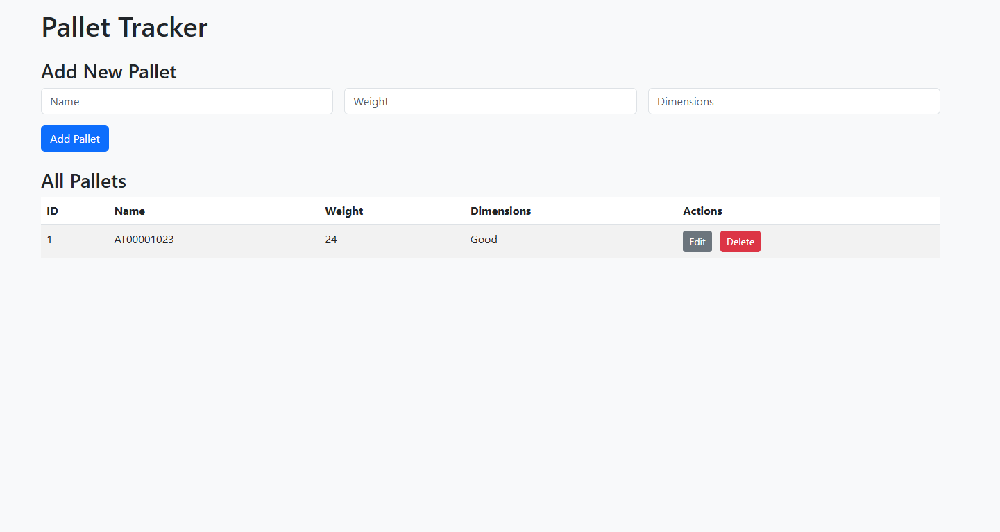

# Pallet Tracking REST API

A simple FastAPI application demonstrating CRUD operations for managing pallets.

**Swagger UI**


**Front-End UI**




## Features

- Create, read, update, delete pallets
- SQLite database with SQLAlchemy
- Pydantic schemas for validation
- Swagger UI auto-generated documentation
- A simple HTML/JavaScript front-end to interact with the API

## How to Run

1. Install dependencies:
pip install fastapi uvicorn sqlalchemy pydantic
2. Start the server: 
uvicorn main:app --reload
3. Open Swagger UI:
http://127.0.0.1:8000/docs to see endpoints
4. Open index.html in your browser. 


## Endpoints

- `POST /pallets/`
- `GET /pallets/{id}`
- `PUT /pallets/{id}`
- `DELETE /pallets/{id}`

## Example Payload

```json
{
"name": "Pallet A",
"weight": 100.0,
"dimensions": "120x80x100"
}


